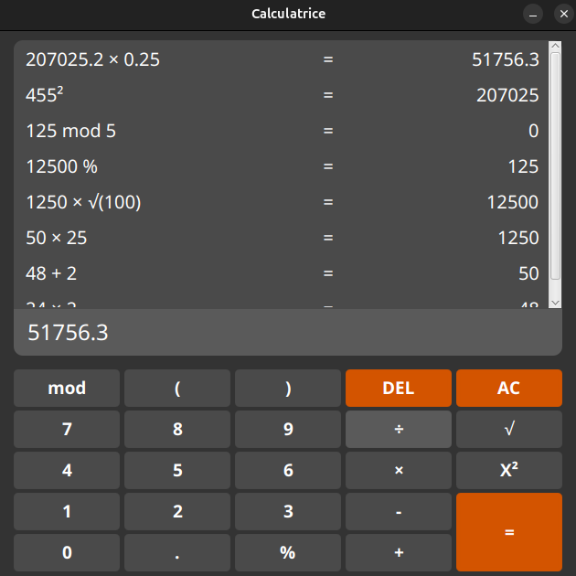

# Calculatrice JavaFX


Une calculatrice moderne et élégante développée avec JavaFX, inspirée du design de la calculatrice GNOME sous Ubuntu.


## Fonctionnalités

- **Opérations de base** : Addition, soustraction, multiplication, division
- **Opérations avancées** :
    - Modulo (mod)
    - Racine carrée (√)
    - Puissance au carré (X²)
    - Pourcentage (%)
    - Parenthèses pour l'ordre des opérations
- **Historique** : Affichage des calculs précédents
- **Interface intuitive** : Design sombre moderne avec des boutons colorés
- **Support clavier** : Touche Entrée pour calculer

## Technologies utilisées

- **Java 17+** : Langage de programmation
- **JavaFX** : Framework d'interface graphique
- **exp4j** : Bibliothèque d'évaluation d'expressions mathématiques
- **Maven** : Gestion des dépendances

## Prérequis

- Java Development Kit (JDK) 17 ou supérieur
- Maven 3.6 ou supérieur

## Installation

1. **Cloner le dépôt**
   ```bash
   git clone https://github.com/[ton-username]/calculator-javafx.git
   cd calculator-javafx
   ```

2. **Compiler le projet**
   ```bash
   mvn clean compile
   ```

3. **Lancer l'application**
   ```bash
   mvn javafx:run
   ```

## Structure du projet

```
src/main/java/com/calculator/
├── App.java                          # Point d'entrée de l'application
├── model/
│   └── CalculatorModel.java          # Logique métier et calculs
├── view/
│   └── CalculatorView.java           # Interface utilisateur
└── controller/
    └── CalculatorController.java     # Gestion des événements
```

Le projet suit le **pattern MVC (Model-View-Controller)** pour une meilleure séparation des responsabilités.


## Utilisation

1. **Saisir une expression** : Cliquez sur les boutons ou utilisez votre clavier
2. **Calculer** : Appuyez sur `=` ou la touche Entrée
3. **Effacer** :
    - `AC` : Efface tout
    - `DEL` : Supprime le dernier caractère
4. **Historique** : Les calculs précédents s'affichent en haut

## Licence

Ce projet est sous licence MIT. À usage éducatif.

## Auteur

**Steve Anderson H.**
- GitHub: [@SteveAnderson95](https://github.com/SteveAnderson95)
- LinkedIn: [Steve Anderson H.](https://www.linkedin.com/in/steve-anderson-h-931861347/)

## Remerciements

- Inspiration design : Calculatrice GNOME (Ubuntu)
- Bibliothèque exp4j pour l'évaluation des expressions
- La communauté JavaFX

---

⭐ N'hésitez pas à mettre une étoile si ce projet vous a plu ! Plz